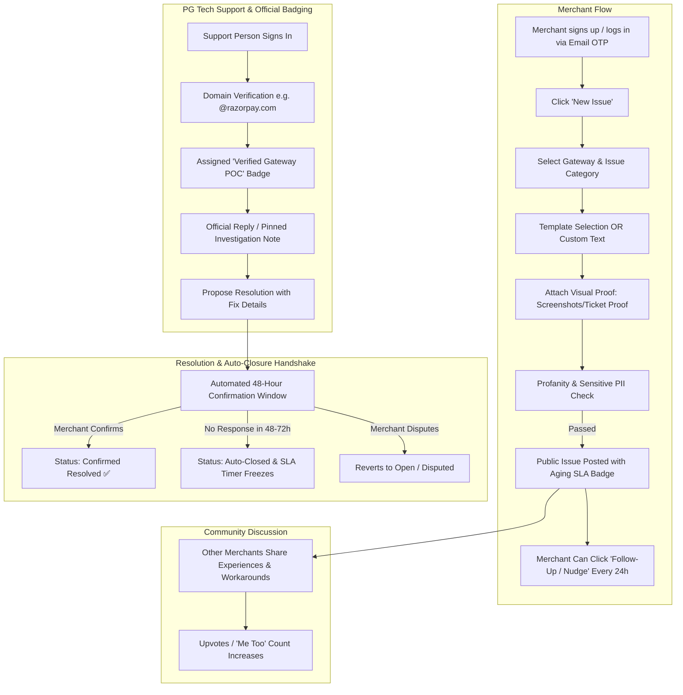

# GatewayPulse (PGWatch) ⚡
> A public accountability, community feedback, and issue-resolution platform for merchants dealing with Payment Gateway (PG) disruptions.

---

## 📖 1. Overview & Problem Statement

Payment gateways (Razorpay, Stripe, Cashfree, PayU, Paytm, PhonePe, etc.) are the lifeline of modern digital merchants. However, when transactions fail, settlements get delayed, or accounts face sudden risk holds, merchants often face opaque customer support channels with slow ticket turnarounds.

**GatewayPulse** bridges this gap as a specialized, "Twitter-like" public forum focused exclusively on payment gateway challenges. It creates transparency, tracks resolution SLAs visually, allows peer-to-peer troubleshooting, and provides payment gateway technical teams a direct, authenticated channel to resolve merchant grievances publicly.

---

## 🎯 2. Core User Personas & Workflows



---

## ✨ 3. Detailed Feature Breakdown

### A. Merchant Experience & Issue Creation
1. **Passwordless Email OTP Authentication**:
   - Frictionless sign-in: merchants enter their business email, receive a 6-digit one-time passcode (OTP), and are authenticated instantly.
2. **Structured Issue Creation Wizard**:
   - **Step 1: Select Brand/Gateway** (e.g., Razorpay, Cashfree, Stripe, PayU, PhonePe, CCAvenue).
   - **Step 2: Select Issue Domain** (e.g., *Settlement Delay*, *Failed Webhooks*, *Transaction Spike Failures*, *Chargeback/Dispute*, *Account/Risk Freeze*).
   - **Step 3: Issue Description Mode**:
     - *Pre-written Standard Templates*: Rapid 1-click posting for common known issues (e.g., *"T+2 settlement delayed beyond 48 hours without dashboard update"*).
     - *Custom Description*: Open text editor with formatted bullet points.
3. **Visual Proof & Attachment Uploads**:
   - Merchants can attach screenshots of gateway error dashboards, webhook 500 logs, or support ticket receipts.
   - **Security First**: Client-side reminder and PII redaction warning ensuring merchants do not expose customer credit card numbers, CVVs, passwords, or secret API keys.
4. **Follow-Up & Nudge Action**:
   - Once an issue is live, the merchant has a **"Follow-Up / Nudge Gateway"** button.
   - **Nudge Cooldown**: Restricted to once every 24 hours to prevent spam while bumping the issue and notifying PG representatives.
   - **Timeline Update**: Merchant can attach follow-up log entries (e.g., *"Follow-up #1: Still no response on official ticket #8921"*).
5. **Community Following**:
   - Other affected merchants can click **"Follow Issue"** or **"Me Too"** to receive instant notifications upon official gateway updates.

---

### B. Dynamic Aging & SLA Tagging Matrix
Issues are visually tagged with color-coded timers to indicate responsiveness and hold gateways accountable:

| Age Range | Status Color | Visual Indicator | Meaning |
| :--- | :--- | :--- | :--- |
| **0 – 2 Days** | 🟢 **Green** | `[Active / Fresh]` | Recently reported, within standard acknowledgment window |
| **3 – 4 Days** | 🟡 **Yellow** | `[Pending Attention]` | Approaching SLA delay without meaningful response |
| **5 – 7 Days** | 🟠 **Orange** | `[Delayed]` | Prolonged turnaround; flagged for priority PG intervention |
| **> 7 Days** | 🔴 **Red** | `[SLA Breached]` | Severe delay; highlighted on the public PG leaderboard |
| **Resolved** | ⚪ **Grey / Blue** | `[Resolved ✅]` | Official solution verified or auto-closed; SLA timer stopped |

---

### C. Community Discussion vs. Verified PG Support Badging

#### Who Can Reply?
The platform uses an open discussion model (similar to GitHub Issues or Reddit), but with strict, unmistakable role segregation:

1. **Verified PG Representatives (Authorized POC)**:
   - **Authentication**: Must sign up with their official corporate email (e.g., `*@razorpay.com`, `*@cashfree.com`, `*@stripe.com`).
   - **Prominent Visual Badge**: Replies receive a **"Verified Gateway POC"** badge with company logo and distinct color highlighting.
   - **Pinned Responses**: Official replies are pinned to the top of the discussion thread.
   - **Administrative Privileges**: Only verified POCs can change lifecycle statuses (e.g., `Investigating`, `Fix Deployed`, `Propose Resolution`).
2. **Community Merchants & Peers**:
   - Any registered merchant can reply to share troubleshooting tips, confirmation of regional outages, or workaround solutions.
   - Labeled with standard **"Merchant"** badges.
3. **Original Poster (OP)**:
   - Labeled with an **"Author / OP"** badge.
4. **Thread Filter**:
   - A toggle allowing users to switch between:
     - `Show All Discussion` (community view).
     - `Official Responses Only` (filtered exclusively to verified PG statements).

---

### D. Preventing "Zombie / Abandoned" Open Tickets (Closure Handshake)

A common challenge in public issue trackers is that a payment gateway may resolve the issue, but the merchant forgets to close the ticket on the platform—unfairly leaving the PG with a "Red / SLA Breached" ticket. 

GatewayPulse solves this through a **Two-Way Resolution Handshake & Automated Soft-Close**:

```
[ PG Rep clicks 'Propose Resolution' with notes ]
                      │
                      ▼
[ System sends Email/Push Alert to Merchant ]
         │                              │
         ▼ (Merchant Confirms)          ▼ (Merchant Inactive)
[ Immediate 'Resolved' Status ]   [ 48-72 Hour Countdown Timer ]
                                        │
                                        ▼ (Timer Expires)
                                  [ 'Auto-Closed' Status ]
                                  [ SLA Clock Freezes at PG Reply Time ]
```

1. **Direct Merchant Close**:
   - The merchant can click **"Mark as Resolved"** at any time.
2. **PG Resolution Proposal**:
   - A verified PG POC marks the issue as `Proposed Resolution` and supplies resolution details (e.g., *"Batch settlement #4412 re-processed at 11:00 AM IST"*).
3. **Automated 48–72 Hour Grace Period**:
   - The merchant receives an automated notification: *"Razorpay has marked your issue as resolved. Does this resolve your problem?"*
   - **Action A: Merchant Confirms** ➔ Ticket transitions immediately to `Resolved (Confirmed by Merchant)`.
   - **Action B: Merchant Disputes** ➔ Ticket remains `Open / Disputed` and PG rep is notified.
   - **Action C: Merchant Does Not Respond (Inactive)** ➔ After **48 to 72 hours**, the system automatically transitions the ticket to `Closed (Auto-Resolved)`.
   - **Fair SLA Calculation**: When an issue is auto-closed, the recorded resolution time stops at the **exact timestamp the PG representative posted the solution**, ensuring the gateway's SLA score is not penalized for merchant inactivity.
4. **7-Day Re-open Window**:
   - If an issue was auto-closed but the underlying issue reoccurs, the merchant can re-open it within 7 days.

---

### E. Public Transparency & PG Leaderboard Dashboard
- **Gateway Health Index**:
  - Total open vs. resolved complaints per gateway.
  - Average Time to Acknowledgment and Mean Time to Resolution (MTTR).
  - SLA breach percentage (tickets turning red).
- **Public Timeline Feed**:
  - Filterable by Gateway, Category, SLA Tag Color, and Resolution Status.

---

## 🛡️ 4. Content Moderation & Abuse Prevention

- **Profanity & Vulgarity Filter**: Real-time lexical analysis rejecting abusive or defamatory language.
- **Automated PII Masking**: Detection and redaction for card PANs, CVVs, and secret API keys in both text and uploaded screenshot previews.
- **Rate Limiting & Anti-Spam**: Prevents automated bot postings and limits follow-up pings to 1 per 24 hours per user.

---

## 🏗️ 5. Recommended Architecture & Tech Stack

```
[ Frontend: Next.js 14+ / Tailwind CSS / Shadcn UI / Lucide ]
                         │
                         ▼
[ Backend API: Next.js Server Actions / Node.js Express ]
   ├── Auth: Passwordless Email OTP (Resend / Supabase Auth)
   ├── File Storage: AWS S3 / Cloudinary / Supabase Storage (Visual Proof)
   ├── Moderation: bad-words / leo-profanity + Regex PII Filter
   └── Background Engine: Inngest / QStash (Aging Cron & 48h Auto-Close Timer)
                         │
                         ▼
[ Database: PostgreSQL (via Prisma ORM) & Redis (Rate Limiting) ]
```

---

## 🗄️ 6. Core Database Schema (Updated Prisma Models)

```prisma
// Complete Prisma Schema Blueprint

enum UserRole {
  MERCHANT
  PG_SUPPORT
  ADMIN
}

enum IssueStatus {
  OPEN
  INVESTIGATING
  PROPOSED_RESOLUTION // Marked by PG POC, pending merchant confirmation
  RESOLVED            // Confirmed by merchant
  AUTO_CLOSED         // Closed automatically after 48-72h of merchant inactivity
  DISPUTED            // Merchant disputed PG's proposed resolution
}

model User {
  id            String       @id @default(cuid())
  email         String       @unique
  role          UserRole     @default(MERCHANT)
  companyName   String?
  isVerified    Boolean      @default(false)
  domain        String?      // Extracted from email (e.g., razorpay.com)
  createdAt     DateTime     @default(now())
  issues        Issue[]
  comments      Comment[]
  followedIssues IssueFollow[]
}

model PaymentGateway {
  id            String       @id @default(cuid())
  name          String       @unique // e.g., "Razorpay"
  slug          String       @unique // e.g., "razorpay"
  domain        String       // e.g., "razorpay.com" for authorized POC validation
  logoUrl       String?
  issues        Issue[]
}

model Category {
  id            String       @id @default(cuid())
  name          String       // e.g., "Settlements", "Webhooks", "Refunds"
  templates     Template[]
  issues        Issue[]
}

model Template {
  id            String       @id @default(cuid())
  categoryId    String
  category      Category     @relation(fields: [categoryId], references: [id])
  title         String
  body          String
}

model Issue {
  id               String          @id @default(cuid())
  title            String
  description      String
  status           IssueStatus     @default(OPEN)
  merchantId       String
  merchant         User            @relation(fields: [merchantId], references: [id])
  gatewayId        String
  gateway          PaymentGateway  @relation(fields: [gatewayId], references: [id])
  categoryId       String
  category         Category        @relation(fields: [categoryId], references: [id])
  
  // Follow-up / Nudge metrics
  nudgeCount       Int             @default(0)
  lastNudgedAt     DateTime?

  // Resolution handshake fields
  resolutionNotes  String?
  proposedAt       DateTime?
  autoCloseAt      DateTime?       // Set to proposedAt + 48 hours
  resolvedAt       DateTime?

  upvotesCount     Int             @default(0)
  createdAt        DateTime        @default(now())
  updatedAt        DateTime        @updatedAt

  attachments      Attachment[]
  comments         Comment[]
  followers        IssueFollow[]
}

model Attachment {
  id            String       @id @default(cuid())
  issueId       String
  issue         Issue        @relation(fields: [issueId], references: [id], onDelete: Cascade)
  fileUrl       String
  fileType      String       // e.g., "image/png", "application/pdf"
  createdAt     DateTime     @default(now())
}

model Comment {
  id            String       @id @default(cuid())
  issueId       String
  issue         Issue        @relation(fields: [issueId], references: [id], onDelete: Cascade)
  authorId      String
  author        User         @relation(fields: [authorId], references: [id])
  content       String
  
  // Visual badging & verification flags
  isOfficial    Boolean      @default(false) // True if author domain matches Gateway domain
  isPinned      Boolean      @default(false)
  createdAt     DateTime     @default(now())
}

model IssueFollow {
  id            String       @id @default(cuid())
  userId        String
  user          User         @relation(fields: [userId], references: [id])
  issueId       String
  issue         Issue        @relation(fields: [issueId], references: [id], onDelete: Cascade)
  createdAt     DateTime     @default(now())

  @@unique([userId, issueId])
}
```

---

## 📅 7. Phased Implementation Roadmap

- [ ] **Phase 1: Foundation & Auth**
  - Next.js 14 App Router, Tailwind CSS, PostgreSQL + Prisma setup.
  - Passwordless Email OTP authentication for merchants.
  - Corporate email domain whitelist verification for PG POCs (`*@brand.com`).
- [ ] **Phase 2: Issue Creation & Visual Proofs**
  - Wizard UI with Gateway & Category selectors + 1-click templates.
  - Screenshot / ticket proof uploader (S3 / Cloudinary) with PII safety warnings.
  - Profanity filtering pipeline.
- [ ] **Phase 3: Community Threads & Badging**
  - Open comment section for merchants.
  - Verified PG POC highlighted and pinned responses with official badges.
  - Filter toggle: `All Comments` vs `Official PG Only`.
  - Merchant "Follow-Up / Nudge" action (24-hour rate limit).
- [ ] **Phase 4: Aging Engine & Closure Handshake**
  - Dynamic color-coded SLA badges (Green ➔ Yellow ➔ Orange ➔ Red).
  - Two-way resolution handshake: PG marks `Proposed Resolution` ➔ 48-hour countdown ➔ Auto-close with fair SLA timer stop.
- [ ] **Phase 5: Public Metrics & PG Leaderboard**
  - Live complaint statistics per gateway.
  - MTTR and SLA performance scorecards.

---

## 🤝 Contribution & License
This project is open-source and intended to foster collaboration, transparency, and high service quality across payment ecosystems.
